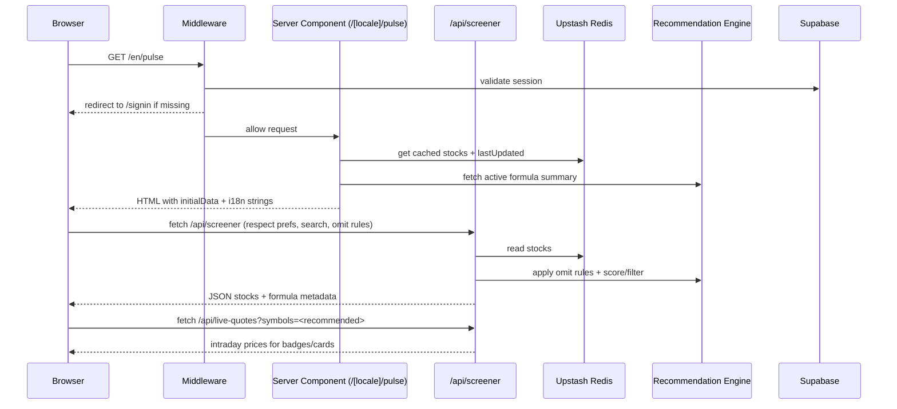

# Nasdaq Pulse – Architecture & Flow

This document explains how the app is put together, why it is shaped this way, and how data moves from providers to the UI. It is meant to be readable without the codebase open; file paths are included for deeper dives.

## Product Intent (motivation)
- Deliver a fast, bilingual (EN/HE, RTL-aware) Nasdaq/TLV stock screener with opinionated recommendations.
- Keep free-tier friendly by front-loading caching (Upstash Redis) and batching provider calls.
- Keep access gated to invited users while still allowing easy sharing through magic links.
- Ship as a single Next.js app (App Router) deployable to Vercel with minimal extra infra.

## High-Level Architecture

```mermaid
graph TD
  User[Browser] -->|SSR/CSR| NextApp[Next.js App Router<br/>pages & layouts]
  NextApp -->|Route Handlers| API[App APIs under /api/*]
  API -->|sessions| Supabase[Supabase Auth + Postgres]
  API -->|cache read/write| Upstash[Upstash Redis (KV)]
  API -->|quotes/growth/news| Providers[Yahoo Finance, Finnhub, NewsAPI/TwelveData (future)]
  API -->|config| Env[Env vars + feature flags]
  NextApp -->|client fetch| API
  Cron[Vercel Cron (refresh-stocks, refresh-stocks-nz)] --> API
  Upstash --> NextApp
```

## Runtime Pieces

- **Next.js App Router (v16)**  
  - Public landing (`src/app/[locale]/page.tsx`) and protected dashboard (`src/app/[locale]/pulse/page.tsx`).  
  - Layouts set RTL/LTR direction per locale (`src/app/[locale]/layout.tsx`).  
  - Client-side shell for the screener (`PulseWrapper` → `ScreenerClient` + `StockDetail`).

- **Authentication & Access Control**  
  - Supabase Auth (Google OAuth + magic link) handled in `src/app/[locale]/signin` and callback handler `src/app/[locale]/auth/callback/page.tsx`.  
  - Middleware (`src/middleware.ts`, `src/lib/supabase/middleware.ts`) refreshes sessions and redirects unauthenticated users hitting `/pulse` or `/settings`.  
  - Invitations and roles are stored in Supabase (`src/app/api/admin/invitations/route.ts`); RPCs enforce allowlist and roles server-side.

- **API Layer (Route Handlers)**  
  - Screener data: `GET /api/screener` → combines Redis cache + recommendation engine + omit rules.  
  - Stock detail: `GET /api/stock/[symbol]` → Yahoo growth + profile enrichment.  
  - Live quotes batch: `GET /api/live-quotes` → Yahoo Spark batching.  
  - News: `GET /api/news` (+ per-symbol) currently stubbed with demo data.  
  - Preferences sync: `GET/POST /api/preferences` backs up local prefs to Supabase.  
  - Admin endpoints: recommendation formulas/settings, omit rules, invitations, users.

- **Data & Caching Layer (`src/lib/market-data`)**  
  - **Upstash Redis** (`storage.ts`) stores screener-ready stock rows, profiles, history, symbols, and refresh run logs.  
  - **Providers**: Yahoo (quotes, history, growth, batch), Finnhub (profiles, symbols), static company info, and mock data for graceful degradation.  
  - **Recommendation Engine** (`lib/recommendations/*`): expression parser (expr-eval) with a safe whitelist, active formula cached for 5 minutes, omit rules per user/admin, scoring helpers used by `/api/screener`.

- **Client State**  
  - Preferences hook `usePreferences` keeps sort/limit/exchange/hidden symbols in localStorage and syncs to Supabase.  
  - Live quotes hook `useLiveQuotes` fetches only currently recommended symbols to limit bandwidth.  
  - Locale dictionaries live in `src/lib/i18n.ts`, driving EN/HE copy and RTL toggles.

- **Background Jobs**  
  - Cron endpoints (`/api/cron/refresh-stocks`, `/api/cron/refresh-stocks-nz`) pull fresh Yahoo data nightly; Finnhub is used only to refresh the NASDAQ symbol list. Results are persisted to Redis and logged.

## Request/Render Flows

### Pulse Page (dashboard) load


### Data refresh pipeline
```mermaid
graph LR
  CronA[Vercel cron A-K] --> RH[refresh-stocks.ts]
  CronB[Vercel cron L-Z + TLV] --> RH
  RH -->|Finnhub| Symbols[NASDAQ symbols]
  RH -->|Yahoo| Quotes[Quotes + 1y growth + history]
  RH --> Merge[Merge with existing cache]
  Merge --> Redis[(Upstash Redis)]
  Redis --> Status[/api/status]
  Redis --> Screener[/api/screener]
```

### Recommendation filtering inside `/api/screener`
1) Load stocks from Redis (or mock fallback).  
2) Apply search and omit rules (user-specific or admin defaults).  
3) Score with active formula (defaults to `growth1m * 0.6 + growth6m * 0.3 + growth12m * 0.1`).  
4) If `recommendedOnly=true`, keep positive scores; else attach scores for UI badges.  
5) Slice by requested limit and return updatedAt/source metadata.

## Data Contracts (simplified)
- **Stock row (cached)**: `symbol`, `name`, `price`, `growth{1d,5d,1m,6m,12m}`, `exchange`, `marketCap?`, `nameHebrew?`, `hasSplitWarning?`.  
- **ScreenerResponse**: `stocks[]`, `updatedAt`, `exchange`, `source`, `recommendation.activeFormula`.  
- **Preferences** (local + Supabase): `sortBy`, `limit`, `exchange`, `hiddenSymbols` keyed by exchange, `showRecommendedOnly`, `preRecommendedState`.

## Why these choices
- **Redis-first reads** keep the dashboard <200ms TTFB even when providers are slow; cron amortizes cost.  
- **Yahoo Spark batching** avoids per-symbol calls for live badges while staying keyless.  
- **Supabase Auth** unifies OAuth, magic links, invitations, and RLS-enforced admin APIs without adding another IdP.  
- **Recommendation formulas** are data-driven so admins can tune scoring without redeploying.  
- **Omit rules** let admins/users clamp out penny stocks or illiquid tickers server-side to prevent noisy results.

## UX & i18n notes
- RTL/LTR are set at layout level; components rely on `data-dir` attributes instead of separate CSS bundles.  
- Dictionary-driven copy (`src/lib/i18n.ts`) keeps translations colocated with feature text.  
- Watchlist hiding is persisted per exchange so TLV/NASDAQ don’t conflict.

## Observability & Health
- `/api/status` reports last refresh time, stock count, recent run history, and marks data stale if older than 26h.  
- Cron routes return per-range success/failed symbols to aid debugging.  
- Active formula cache TTL (5 minutes) balances DB hits with instant admin updates (cache is busted on update).

## Example interactions
- Fetch screener with recommendations only:  
  `GET /api/screener?exchange=nasdaq&recommendedOnly=true&includeScores=true&limit=200`
- Fetch live quotes for top picks:  
  `GET /api/live-quotes?symbols=NVDA,SMCI,META`
- Fetch stock detail page data:  
  `GET /api/stock/NVDA`

## Open Questions / Improvement Paths
- Should we replace the Yahoo unofficial API with a paid provider (e.g., Polygon, Tiingo) for reliability and split detection?  
- Redis is single-region; do we need multi-region or edge caching for lower p95 outside US-East?  
- News is stubbed; pick a provider (Finnhub vs MarketAux vs NewsAPI) and standardize schema (sentiment, symbols).  
- Do we keep Supabase Auth only, or re-introduce NextAuth for non-Supabase deployments?  
- Recommendation formulas are free-form expressions; should we add a library of presets and validation against historical backtests?  
- Cron auth: `refresh-stocks-nz` currently has the auth check commented out—restore before production.  
- Consider persisting watchlists server-side (per user) to survive device changes and enable sharing.  
- Charts use `lightweight-charts`; would `@visx/xychart` or `Recharts` give better mobile ergonomics and accessibility?

## Reference Map (useful files)
- UI shell: `src/app/[locale]/pulse/page.tsx`, `src/app/[locale]/pulse/components/*`  
- Auth: `src/app/[locale]/signin/*`, `src/app/[locale]/auth/callback/page.tsx`, `src/middleware.ts`  
- API: `src/app/api/screener/route.ts`, `src/app/api/live-quotes/route.ts`, `src/app/api/stock/[symbol]/route.ts`, `src/app/api/preferences/route.ts`  
- Data layer: `src/lib/market-data/*`, `src/lib/recommendations/*`, `src/lib/cron/refresh-stocks.ts`, `src/lib/market-data/storage.ts`  
- Admin: `src/app/api/admin/*`  
- i18n: `src/lib/i18n.ts`
